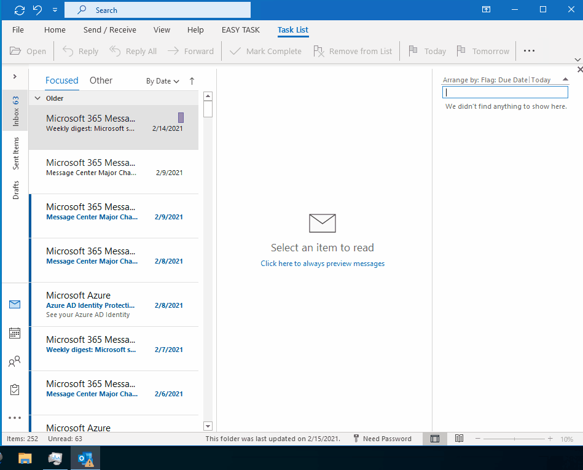

# Intro
EasyTask Outlook add-in extends standard tasks functionality of Outlook 2007-2021 with ability to specify tasks due dates and categories directly from the task naming, streamlining the tasks management. 
You can specify when you want the task due date by using natural language in the task name.

⚠️The add-in doesn't work with the latest Web Based Outlook where the tasks were replaced with integration with Microsoft To Do. 

Anyway you can look at the code if interested.
Check out `OutlookControlsExtensions` for how to extend standard Outlook edit box functionality with extra features like filtered drop down. 
To make the dropdown work make sure that you enable this view in Outlook and then restart it. 

# Demo

# Source code
## Dependencies
[WiX Toolkit v3](https://docs.firegiant.com/wix/wix3/) is used for building installer. To make the compilation process easier [WiX toolset extension for Visual Studio 2022](https://marketplace.visualstudio.com/items?itemName=WixToolset.WixToolsetVisualStudio2022Extension) is recommended to be installed.
## How to compile
To compile the the sources from source code is pretty straight forward.
1. Open `EasyTask/EasyTaskAddin.sln`
2. Restore Nuget packages
3. Compile
4. Run the installer or debug (MS Outlook 2021 or earlier is requried)
